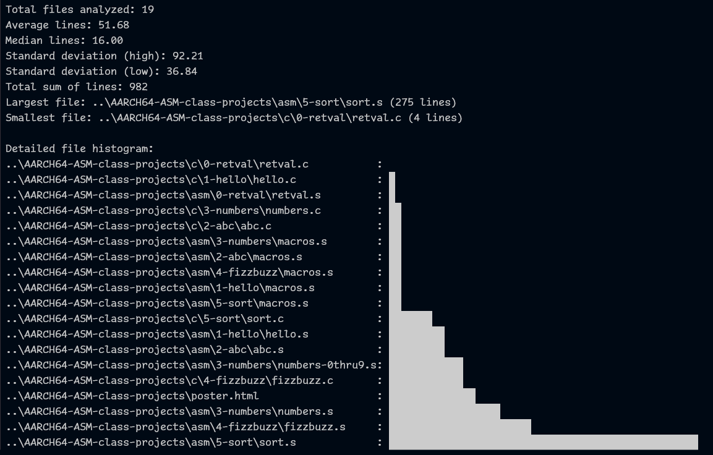

# codesiz

codesiz is a command-line utility written in Go that analyzes source code file lengths.



## Features
- Recursively scans directories for files.
- Configurable file extensions via an external JSON configuration.
- Computes statistics such as total files, total lines, average lines, median lines, largest/smallest file size, and standard deviations.
- Output options:
  - `-l` for detailed listing.
  - `-s` for sorted output (smallest to largest).
  - `-h` for a graphical histogram representation.
  - `-a` to analyze all files (not just those matching configured extensions).
  - `-j` for JSON output of the analysis results.
  - `-?` help / usage information.

## Building

1. Ensure you have Go installed.
2. Clone the repository.
3. Build for Windows:
```
go build -o codesiz.exe main.go
```
4. Build for Linux:
```
go build -o codesiz main.go
```

